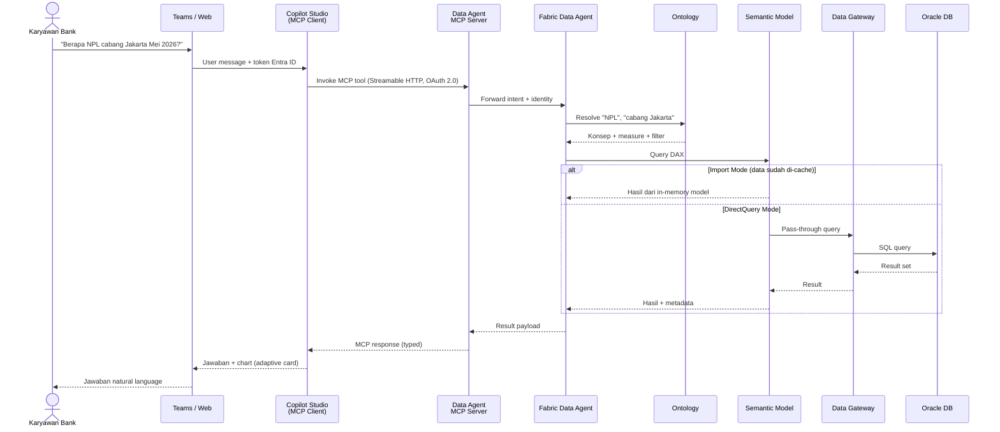

# Proposed Solution – Contoso Bank
## End‑to‑End Analytics & AI dengan Microsoft Fabric + Copilot Studio

> Dokumen ini menjelaskan arsitektur usulan untuk Contoso Bank dengan sumber data **Oracle on‑premises**, dihubungkan ke **Microsoft Fabric** melalui **On‑premises Data Gateway**, kemudian dimodelkan menggunakan **Semantic Model (Import / DirectQuery)**, diperkaya dengan **Fabric IQ Ontology**, dan di‑expose ke pengguna bisnis melalui **Fabric Data Agent** yang terintegrasi dengan **Microsoft Copilot Studio**.

---

## ⚠️ Disclaimer

- Dokumen ini bersifat **proposal arsitektur tingkat tinggi (high‑level design)** dan **bukan** dokumen kontraktual, komitmen layanan, atau jaminan implementasi.
- "**Contoso Bank**" adalah **nama fiktif** yang digunakan Microsoft untuk tujuan ilustrasi. Dokumen ini **tidak** merepresentasikan institusi keuangan nyata.
- Konten dihasilkan dengan bantuan **AI (GitHub Copilot)** dan dirujuk ke **Microsoft Learn** per **Mei 2026**. Beberapa fitur (mis. *Fabric Data Agent MCP server*, *Fabric Core MCP*, *Fabric IQ Ontology*) berstatus **Preview** sehingga dapat berubah sebelum General Availability — selalu verifikasi ke dokumentasi resmi terbaru.
- Penyebutan SKU, harga, region, dan estimasi performa bersifat **indikatif**. Sizing & lisensi final harus divalidasi bersama tim arsitek Microsoft / partner resmi.
- Implementasi nyata wajib mempertimbangkan **regulasi setempat** (mis. POJK/OJK, UU PDP, BCBS 239) dan kebijakan keamanan internal bank.
- Microsoft, penulis, dan kontributor **tidak bertanggung jawab** atas kerugian yang timbul akibat penggunaan langsung dokumen ini tanpa kajian lanjutan oleh tim profesional.

---

## 1. Tujuan Solusi

Contoso Bank ingin:

1. Tetap menyimpan data transaksional inti di **Oracle Database on‑premises** (alasan regulasi & latency).
2. Menyediakan **single source of truth** analitik yang aman di cloud (Microsoft Fabric / OneLake).
3. Memberikan akses **self‑service BI** kepada analis (laporan Power BI).
4. Memberikan akses **natural language Q&A** (bahasa Indonesia/Inggris) kepada karyawan front‑office melalui **chatbot Copilot Studio** — tanpa perlu menulis SQL/DAX.
5. Menjamin jawaban AI **konsisten dengan definisi bisnis** (mis. definisi "Nasabah Aktif", "NPL", "CASA Ratio") melalui **ontology**.

---

## 2. Komponen Arsitektur

| # | Komponen | Peran | Catatan |
|---|----------|-------|---------|
| 1 | **Oracle Database (On‑Prem)** | Sumber data utama: Core Banking, CRM, Loan, Card. | Tetap di Data Center Contoso. |
| 2 | **On‑premises Data Gateway** | Jembatan aman antara Oracle dan Microsoft Fabric / Power BI. Semua query dari Semantic Model ke Oracle melewati gateway ini. | Disarankan **Standard Mode** + **High Availability cluster** (min. 2 node). |
| 3 | **Semantic Model (Power BI di Fabric)** | Model bisnis (tables, relationships, measures, hierarchies, RLS). **Konek langsung ke Oracle via Data Gateway** — tidak ada lakehouse/pipeline di tengah. | **Dua opsi**: Import Mode atau DirectQuery — lihat §4. |
| 4 | **Fabric IQ – Ontology** | Lapisan **business semantics**: konsep, relasi, sinonim, KPI standar. | Membuat AI memahami istilah bisnis ("nasabah prioritas", "saldo rata‑rata"). |
| 5 | **Fabric Data Agent** | AI agent yang menjawab pertanyaan natural language di atas Semantic Model + Ontology. | Dapat di‑expose sebagai **MCP server** (preview). |
| 6 | **Model Context Protocol (MCP)** | Standar terbuka untuk menghubungkan AI agent (Copilot Studio, VS Code, Claude, Foundry) ke sumber data/tool secara konsisten. | **Fabric Data Agent → MCP Server**; **Copilot Studio → MCP Client**. Transport **Streamable HTTP**, auth OAuth 2.0 / API key. |
| 7 | **Microsoft Copilot Studio** | Front‑end chatbot untuk karyawan/nasabah internal. | Memanggil Fabric Data Agent via **MCP tool** (rekomendasi). Wajib aktifkan *generative orchestration*. |
| 8 | **Microsoft Entra ID** | Autentikasi & otorisasi (SSO, MFA, Conditional Access). | Single identity di seluruh layer, termasuk OAuth 2.0 untuk MCP. |

---

## 3. Arsitektur Diagram (Mermaid)

```mermaid
flowchart LR
    subgraph OnPrem["🏢 Contoso Bank Data Center (On-Premises)"]
        ORA[("Oracle Database<br/>Core Banking / CRM / Loan")]
        GW["On-Premises Data Gateway<br/>(HA Cluster)"]
        ORA -->|JDBC/ODBC| GW
    end

    subgraph Fabric["☁️ Microsoft Fabric"]
        direction TB
        SM["Semantic Model<br/>(Import / DirectQuery)<br/>konek langsung ke Oracle"]
        ONT["Fabric IQ Ontology<br/>(Business Concepts & KPI)"]
        AGENT["Fabric Data Agent<br/>(NL → Query)"]
        MCP{{"MCP Server Endpoint<br/>(Streamable HTTP + OAuth 2.0)"}}
        SM --> ONT
        ONT --> AGENT
        SM --> AGENT
        AGENT --> MCP
    end

    subgraph Consumers["👥 Konsumen"]
        PBI["Power BI Reports<br/>& Dashboards"]
        CS["Microsoft Copilot Studio<br/>(Chatbot Karyawan)"]
        TEAMS["Microsoft Teams /<br/>Web Channel"]
    end

    subgraph Security["🔐 Cross-Cutting"]
        ENTRA["Microsoft Entra ID<br/>(SSO • MFA • RLS/OLS)"]
    end

    GW ==>|Secure outbound<br/>HTTPS 443<br/>(Import refresh & DirectQuery)| SM
    SM --> PBI
    MCP ==>|MCP tool| CS
    CS --> TEAMS

    ENTRA -.-> GW
    ENTRA -.-> Fabric
    ENTRA -.-> CS

    classDef onprem fill:#FFE8CC,stroke:#D97706,color:#000
    classDef fabric fill:#CCE5FF,stroke:#1E40AF,color:#000
    classDef consumer fill:#D1FAE5,stroke:#047857,color:#000
    classDef sec fill:#F3E8FF,stroke:#6D28D9,color:#000
    class ORA,GW onprem
    class SM,ONT,AGENT,MCP fabric
    class PBI,CS,TEAMS consumer
    class ENTRA sec
```

---

## 4. Pilihan Semantic Model: Import vs DirectQuery

Semantic Model **konek langsung** ke Oracle on‑prem melalui **On‑premises Data Gateway** — **tanpa** Lakehouse/Warehouse dan **tanpa** Data Pipeline/Dataflow di tengah. Tersedia **dua mode** yang bisa dipilih per use‑case (atau dikombinasikan via *Composite Model*).

### Opsi A — **Import Mode** (Direkomendasikan untuk dashboard eksekutif & Copilot)
- Data ditarik **langsung dari Oracle via Data Gateway** dan disimpan di model Power BI (in‑memory VertiPaq) sesuai jadwal **scheduled refresh** (mis. tiap jam / harian).
- **Performa query sangat cepat** karena data sudah di memori Fabric.
- Mendukung penuh DAX, agregasi kompleks, dan **cocok untuk AI / Copilot** karena response time rendah.
- **Trade‑off**: data tidak real‑time (tergantung frekuensi refresh); ukuran model dibatasi kapasitas Fabric SKU; refresh window membebani Oracle.

### Opsi B — **DirectQuery Mode** (untuk data near real‑time)
- Setiap query user dieksekusi **langsung ke Oracle** melalui Data Gateway — tidak ada salinan data di Fabric.
- **Data selalu up‑to‑date** (mis. saldo nasabah saat ini).
- **Trade‑off**: latency tergantung Oracle & gateway; beberapa fungsi DAX terbatas; setiap interaksi user = beban query ke Oracle.
- Wajib: indexing yang baik di Oracle + *aggregations table* + *query reduction* di Power BI.

### Rekomendasi Hybrid (Composite Model)
| Tabel | Mode | Alasan |
|-------|------|--------|
| Dim_Customer, Dim_Product, Dim_Branch | Import | Jarang berubah |
| Fact_Transaction (historis > 1 hari) | Import | Volume besar, tidak berubah |
| Fact_Transaction (today) | DirectQuery | Butuh real‑time |
| Fact_Balance (current) | DirectQuery | Saldo live |

---

## 5. Peran Fabric IQ Ontology

**Ontology** = kamus bisnis yang dapat dibaca mesin. Ia mendefinisikan:

- **Konsep bisnis**: *Customer*, *Account*, *Loan*, *Transaction*, *Branch*.
- **Relasi**: *Customer* `owns` *Account*; *Account* `has` *Transaction*.
- **Sinonim**: "nasabah" = "customer" = "client".
- **KPI standar**: *NPL Ratio*, *CASA Ratio*, *Active Customer*, *AUM*.
- **Pemetaan** ke tabel/kolom di Semantic Model (yang pada gilirannya konek ke Oracle).

**Manfaat untuk Contoso Bank:**
1. Saat user bertanya *"berapa NPL cabang Jakarta bulan lalu?"* — Data Agent tahu pasti rumus NPL & kolom mana yang dipakai.
2. Menghindari jawaban AI yang **inkonsisten** antar departemen.
3. Mempermudah **onboarding** dataset baru (cukup map ke konsep ontology).

---

## 6. Fabric Data Agent + Copilot Studio (via MCP)

### Alur Tanya‑Jawab
1. Karyawan mengetik pertanyaan di **Microsoft Teams** (channel Copilot Studio).
2. **Copilot Studio** (sebagai **MCP client**) mengenali intent, lalu memanggil **Fabric Data Agent MCP tool** melalui endpoint MCP server.
3. **Fabric Data Agent** menerjemahkan natural language → query (DAX) menggunakan:
   - **Ontology** (untuk arti bisnis),
   - **Semantic Model** (untuk struktur, measures, RLS) — yang membaca data dari Oracle via Data Gateway (Import refresh atau DirectQuery pass‑through).
4. Hasil dikembalikan dalam bentuk **angka, tabel, atau chart** di chat.
5. **RLS (Row‑Level Security)** dievaluasi sesuai identitas Entra user → user hanya melihat data cabang/segmen yang berhak.

### Diagram Alur (Mermaid Sequence)



---

## 6.1 Konfigurasi MCP (Penting)

Microsoft Fabric & Copilot Studio mengadopsi **MCP** sebagai standar integrasi AI agent. Untuk Contoso Bank kami merekomendasikan **3 jenis MCP server** sesuai use‑case:

| MCP Server | Endpoint | Tujuan | Konsumen |
|------------|----------|--------|----------|
| **Fabric Data Agent MCP** *(utama)* | URL per data agent (lihat tab *Settings → Model Context Protocol* setelah publish) | Tanya‑jawab data bisnis (NPL, CASA, dsb) | Copilot Studio, VS Code, Foundry |
| **Fabric Core MCP** *(opsional admin)* | `https://api.fabric.microsoft.com/v1/mcp/core` | Kelola workspace, item, RBAC, capacity via natural language | Tim Platform / DevOps |
| **Eventhouse MCP** *(opsional real‑time)* | URI per KQL DB (`Database details → Copy URI`) | Query log/telemetry real‑time (mis. fraud monitoring) | Tim Risk / SOC |

### Persyaratan & Best Practice
1. **Kapasitas Fabric**: minimal **F2** (atau Power BI Premium P1 dengan Fabric enabled). Untuk produksi bank disarankan **F64+**.
2. **Tenant settings**: aktifkan *cross‑geo processing/storing for AI* sesuai kebijakan data residency.
3. **Authentication**: gunakan **OAuth 2.0** (bukan API key) — Copilot Studio mendukung *Dynamic Discovery (DCR)* yang paling sederhana.
4. **Transport**: **Streamable HTTP** (SSE sudah deprecated sejak Agustus 2025).
5. **Generative orchestration** di Copilot Studio harus **ON** agar dapat memanggil MCP tool.
6. **Deskripsi data agent harus jelas dan akurat** — deskripsi inilah yang menjadi *MCP tool description* dan dipakai orchestrator untuk memutuskan kapan memanggil agent.
7. **Allowed MCP clients**: batasi client ID yang boleh akses (mis. hanya Copilot Studio + VS Code internal).
8. **Audit**: semua panggilan MCP tercatat di Fabric audit log dengan identitas user → memenuhi requirement audit perbankan.

### Contoh `mcp.json` (untuk uji coba developer di VS Code)
```json
{
  "servers": {
    "contoso-bank-data-agent": {
      "type": "http",
      "url": "https://<region>.fabric.microsoft.com/.../mcp"
    }
  }
}
```

---

## 7. Keamanan & Governance

| Aspek | Implementasi |
|-------|--------------|
| **Identitas** | Microsoft Entra ID (SSO, MFA, Conditional Access). |
| **Network** | Gateway hanya **outbound HTTPS 443** ke Azure Service Bus → tidak perlu buka inbound port. |
| **Data in transit** | TLS 1.2+ end‑to‑end. |
| **Data at rest** | Enkripsi otomatis di OneLake (Microsoft‑managed key, opsional CMK). |
| **Row/Object‑Level Security** | Dideklarasikan di Semantic Model, dihormati oleh Power BI **dan** Data Agent. |
| **Sensitivity Labels** | Diterapkan langsung pada artefak Fabric (semantic model, report). |
| **Audit** | Fabric activity log + Copilot Studio analytics + **MCP call audit**. |
| **MCP security** | OAuth 2.0 + RBAC Fabric ditegakkan di setiap MCP call; allowed‑clients list di tenant. |
| **Compliance** | Sesuai POJK / OJK (data PII tetap di on‑prem jika dibutuhkan via DirectQuery). |

---

## 8. Roadmap Implementasi (Indikatif)

| Fase | Aktivitas | Output |
|------|-----------|--------|
| **Fase 1 – Foundation** | Setup Fabric capacity, Entra grup, install Data Gateway HA, konfigurasi Oracle connector. | Konektivitas Oracle ↔ Fabric |
| **Fase 2 – Semantic Layer** | Bangun Semantic Model (Import + DirectQuery hybrid) yang konek langsung ke Oracle via gateway, definisikan measures & RLS. | Semantic Model + Power BI reports |
| **Fase 3 – Ontology** | Definisikan konsep bisnis di Fabric IQ Ontology dan map ke Semantic Model. | Business glossary aktif |
| **Fase 4 – AI Agent + MCP** | Publish Fabric Data Agent → expose sebagai MCP server → daftarkan di Copilot Studio (MCP onboarding wizard, OAuth 2.0). | Chatbot internal berbasis MCP |
| **Fase 5 – Governance & Scale** | Aktifkan governance Fabric, monitoring gateway, training user. | Production rollout |

---

## 9. Asumsi & Hal yang Perlu Diklarifikasi

1. **Fabric SKU** (mis. F64) — perlu disesuaikan dengan volume data & jumlah user Copilot.
2. **Lisensi Copilot Studio** & **Power BI Pro/PPU** untuk end‑user.
3. **Versi Oracle** (≥ 12c direkomendasikan) dan driver di gateway.
4. **Region Azure** (mis. Southeast Asia / Indonesia Central) untuk data residency.
5. **Network**: ExpressRoute atau internet untuk gateway?
6. **Data klasifikasi**: kolom mana yang PII / restricted (untuk masking & RLS).

---

## 10. Referensi (Microsoft Learn)

- [On‑premises data gateway documentation](https://learn.microsoft.com/data-integration/gateway/)
- [Connect to Oracle database from Power Query](https://learn.microsoft.com/power-query/connectors/oracle-database)
- [Semantic models in Power BI / Fabric](https://learn.microsoft.com/power-bi/connect-data/service-datasets-understand)
- [Use DirectQuery in Power BI](https://learn.microsoft.com/power-bi/connect-data/desktop-use-directquery)
- [Composite models in Power BI](https://learn.microsoft.com/power-bi/transform-model/desktop-composite-models)
- [Microsoft Fabric overview](https://learn.microsoft.com/fabric/fundamentals/microsoft-fabric-overview)
- [Fabric Data Agent overview](https://learn.microsoft.com/fabric/data-science/concept-data-agent)
- [Consume Fabric data agent in Copilot Studio](https://learn.microsoft.com/fabric/data-science/data-agent-copilot-studio)
- [Consume Fabric data agent as a Model Context Protocol server](https://learn.microsoft.com/fabric/data-science/data-agent-mcp-server)
- [What are Fabric MCP Servers? (Core vs Pro‑Dev)](https://learn.microsoft.com/rest/api/fabric/articles/mcp-servers/what-is-fabric-mcp-server)
- [Fabric Core MCP Server overview](https://learn.microsoft.com/rest/api/fabric/articles/mcp-servers/core-remote/overview-core-mcp-server)
- [Extend your agent with Model Context Protocol (Copilot Studio)](https://learn.microsoft.com/microsoft-copilot-studio/agent-extend-action-mcp)
- [Connect your agent to an existing MCP server (Copilot Studio)](https://learn.microsoft.com/microsoft-copilot-studio/mcp-add-existing-server-to-agent)
- [Microsoft Copilot Studio documentation](https://learn.microsoft.com/microsoft-copilot-studio/)
- [Row‑level security (RLS) with Power BI](https://learn.microsoft.com/power-bi/enterprise/service-admin-rls)

---

*Dokumen ini adalah usulan arsitektur tingkat tinggi (high‑level design). Detail teknis (sizing, schema, governance policy) akan dilanjutkan pada fase Low‑Level Design.*
